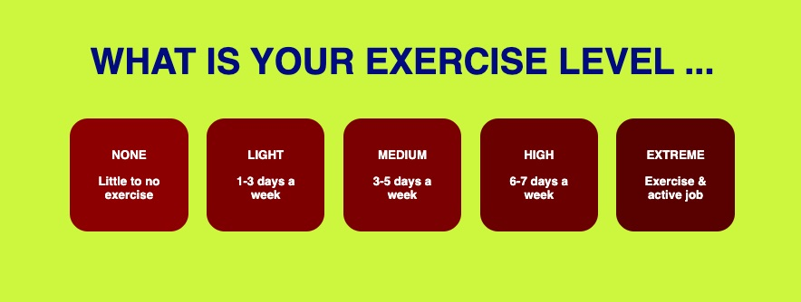

#macroBLASTER, Milestone Project 2

(Developer: Richard Messenger)

[Live webpage](https://rchrdmess.github.io/MS2_macroBLASTER/index.htm)

macroBLASTER is a website designed to introduce users to the concepts of macronutrition (or macros in gym parlance) when considered as part of a workout routine and a balanced diet, guiding them in their targets to encourage a healthy lifestyle and all round general fitness.

The website is designed to be accessible and uniform across all devices, allowing clear comunication of the relevant concepts, people and services within the fitness arena, and enable users to approach the company regarding their services, if required.

## Contents

1. [Project Goals](#project-goals)
    1. [User Goals](#user-goals)
    2. [Site Owner Goals](#site-owner-goals)
    3. [Developer Goals](#developer-goals)
2. [User Experience](#user-experience)
    1. [Target Audience](#target-audience)
    2. [User Requirements and Expectations](#user-requirements-and-expectations)
    3. [User Stories](#user-stories)
3. [Design](#design)
    1. [Design Choices](#design-choices)
    2. [Colours](#colours)
    3. [Fonts](#fonts)
    4. [Structure](#structure)
    5. [Wireframes](#wireframes)
4. [Technologies Used](#technologies-used)
    1. [Languages](#languages)
    2. [Frameworks and Tools](#frameworks-and-tools)
5. [Features](#features)
6. [Testing](#testing)
    1. [HTML Validation](#HTML-validation)
    2. [CSS Validation](#CSS-validation)
    3. [Accessibility](#accessibility)
    4. [Performance](#performance)
    5. [Device testing](#performing-tests-on-various-devices)
    6. [Browser compatibility](#browser-compatibility)
    7. [Testing user stories](#testing-user-stories)
8. [Bugs](#bugs)
    1. [JS Lint](#js-lint)
    2. [JS Hint](#js-hint)
    3. [During Development](#during-development)
    4. [Old Javascript](#old-javascript)
    5. [New Javascript](#new-javascript)
    6. [Old HTML](#old-html)
    7. [New HTML](#new-html)
    8. [Old CSS](#old-css)
    9. [New CSS](#new-css)
    10. [Results](#results)
10. [Deployment](#deployment)
11. [Credits](#credits)
12. [Acknowledgements](#acknowledgements)

## Project Goals

The key goal is to assist users in calculating their daily macro intake based on their fitness goals and current state of health. In doing so, it aims to encourage those (who are now engaged) to seek further information through the site, which can monetise its activities via advertising and corporate tie-ins.

### User Goals

- To find general information about getting healthy
- To help workout what they need to do to achieve their goals
- To enable the user to find a fitness trainer or nutritionist
- To find a site that will support or guide them on their journey
- Provide all the information a user could require in deciding whether to subscribe to the company's services
- Assistance in identifying further information on the subject

### Site Owner Goals

- Promote healthy living
- Provide a tool to engage the user and support them in taking the first step towards a healthier lifestyle
- Increase site traffic
- Provide comprehensive health information
- Design a site that will attract corporate partnerships
- Encourage uptake of the company's subscription services when available
- Communicate the company's credentials
- Separate fitness information from general corporate information

### Developer Goals

- To create a uniform page layout across all devices
- Provide a bug free UX
- To allow the footer's sub-sections to stack vertically on smaller devices
- Easy navigation
- Clear colour contrast for visually impaired users  
  
[Back to Contents](#Contents)  
  
## User Experience

### Target Audience

- Anyone with a newfound desire to maintain a healthy lifestyle
- Anyone with a desire to track their progress (future development)

### User Requirements and Expectations

- Reliable, consistent navigation
- No dead links
- Clear presentation across all devices
- Accessibility
- Not text heavy
- A clear understanding of healthy living

### User Stories

#### First Visit

- What would my daily macro intake be
- Who is macroBLASTER
- What other related information is there
- Can I sign up

#### Repeat visit

- What is my new daily macro intake
- What if I change my workout goals
- What were those healthy living tips
- Can I sign up yet
- Is the data I provide kept private

#### Site Owner

- I want repeat visits
- I want to increase the website traffic
- I want to make our information readily available
- I want to let people know who we are
- I want to encourage people to get healthy  
  
[Back to Contents](#Contents)  
  
## Design

### Design Choices

A uniform layout has been chosen across the website. On the main homepage, the focus is the information box, which can provide the user with information on their daily macro intake requirements. Here, the form is clear, simple and straightforward, to encourage the user to find out more, or "explore", if they choose to. More detailed information is catalogued in the corporate section, reached via the footer on all pages, where it is organised by fitness and company information.

### Colours

When choosing colours, the focus is on accessibility. A number of combinations were tested using a [contrast checker](https://www.siegemedia.com/contrast-ratio) to make sure a score above 4.5 was achieved for text contrasts. Ideally, we aimed for 7.

The scheme chosen was 'bold and bright' as it was felt a strong contrast in colours is energising, and this fits with the theme of motivating the user. 

- Header (logo) background: navy, #000080
- Header (logo) font: yellow, #ffff00
- Background: navy,  #000080
- Header (Slogan) text: white, #ffffff
- Main section text: navy, #000080
- Main section background: bright green, #CBF83E
- Footer headings: bright green, #CBF83E
- Footer text: white, #ffffff
- Male button: dark blue, #000067
- Female button: purple, #7b0077
- Bulk button: turquoise, #003938
- Cut button: turquoise, #005352
- Maintain button: turquoise, #004544
- Placeholder: navy, #000080
- Placeholder background: white, #ffffff
- None button: red, #8b0001
- Light button: red, #7b0000
- Medium button: red, #790001
- High button: red, #6a0001
- Extreme button: red, #580001
- Submit button: green, #025800
- Button text: white, #ffffff

#### Text Ratios

- Logo:Background - 14.9 
- Background:Main 12.98 
- Background:text - 16 
- Placeholder:Placeholder text - 16 
- Main:Male Button - 14.24 
- Main:Female Button - 8.07 
- Main:Bulk Button - 10.37 
- Main:Cut Button - 7.22 
- Main:Maintain Button - 8.8 
- Main:None Button - 8.11 
- Main:Light Button - 9.24 
- Main:Medium Button - 9.39 
- Main:High Button - 10.55 
- Main:Extreme Button - 12.03 
- Main:Submit Button - 7.1 
- Text:Male Button - 17.56 
- Text:Female Button - 9.95 
- Text:Bulk Button - 12.78 
- Text:Cut Button - 8.9 
- Text:Maintain Button - 10.85 
- Text:None Button - 10 
- Text:Light Button - 11.39 
- Text:Medium Button - 11.58 
- Text:High Button - 13.01 
- Text:Extreme Button - 14.83 
- Text:Submit Button - 8.75 

### Fonts

Keeping with the desire for accessibility, sans-serif fonts were used as these are generally considered better for use on screens. Standard font families: helvetica, avenir, verdana and arial were chosen to maintain consistency across all browsers.

For the macroBLASTER font, a more distinctive font was chosen to communicate a unique brand identity. Do Hyeon was selected from Google Fonts.

### Structure

Every page follows the same basic structure, where the header, footer and 'main' section are consistent, as is the colour scheme, creating an easily identifiable layout for navigational purposes. 

The website consists of eleven distinct pages:

##### Main Page
 
- index.htm:  the main page contains the tool/functionality the website is built around. It uses large user friendly buttons to engage the audience and make it easy for them to provide the required information.

#### More Fitness Pages

- what_are_mcros.htm: A page informing the user of macros and the benefits of paying attention to them in relation to a balanced diet and healthy lifestyle.
- warming_up.htm: A page providing the user with a basic guide to warming-up theory and best practice, to be performed prior to exercise.
- aerobics.htm: A page of information on various aerobic exercises and their benefits.
- resistance_training.htm: A page detailing information on resistance training, its benefits and a best approach to undertaking a regular routine.
- injury_rehab.htm: A page of advice on recovering from injury should the user experience any difficulty after undertaking a new regime.

#### Corporate Pages

- faqs.htm: A page containing answers to common questions the user might ask.
- jobs.htm: A page containing information on the latest vacancies.
- press.htm: A page containing press releases.
- privacy.htm: A page containing the privasy statement/policy.
- user_agreement.htm: A page containing the user agreement.

#### 404 Page

- 404.htm: A page containing a redirect link should the incorrect address be typed.

### Wireframes

  
  
[Back to Contents](#Contents)  
  
## Technologies Used

### Languages

- [HTML](https://en.wikipedia.org/wiki/HTML) - 76.3%
- [CSS](https://en.wikipedia.org/wiki/CSS) - 7.7%
- [Javascript](https://en.wikipedia.org/wiki/JavaScript) 12%
- Dockerfile/other - 4%

### Frameworks and Tools

- [Git](https://git-scm.com/)
- [Github](https://github.com/)
- [Balsamiq](https://balsamiq.com/wireframes/)
- [Adobe Suite (Illustrator, Photoshop & InDesign)](https://www.adobe.com/uk/)
- [Font Awesome](https://fontawesome.com/search)
- [Google Fonts](https://fonts.google.com)
- [Favicon](https://iconifier.net)  
- [W3C validator](https://validator.w3.org/)
- [Jigsaw CSS validator](https://jigsaw.w3.org/css-validator/)
- [Text Editor](https://support.apple.com/en-gb/guide/textedit/welcome/mac)
- [Google Chrome](https://www.google.com/chrome/)
- [Apple Voice Over](https://support.apple.com/en-gb/guide/iphone/iph3e2e415f/ios)
- [ChatGPT](https://chat.openai.com)
- [JSLint](https://www.jslint.com)
- [JSHint](https://www.jshint.com)
  
[Back to Contents](#Contents)  
  
## Features

- Macro Calculator

  - The main feature of the home page, the macro calculator, contains buttons and input fields to assist the user in calculating the appropriate level of macros for their daily consumption.
  - It is designed with consideration to accessibility, regarding its font sizes and colour scheme.
  - It uses the vw unit to maintain its shape across all devices.
  - It has built in failsafes to prevent the user from submitting the form incorrectly.
  - User stories covered: 1, 2, 3, 4, 5, 6, 7, 8, 9, 10, 11, 12, 13

- Gender Selection

  

  - Uses javascript (getElementById, eventListeners, and if/else statments) to change the button colours when clicked.
  - An alert is triggered if neither are selected when submit is clicked.

- Goal Selection

  

  - Uses javascript (getElementById, eventListeners, and if/else statments) to change the button colours when clicked.
  - An alert is triggered if none are selected when submit is clicked.
  - An additional alert is placed on the 'Bulk' button to advise the user that a resistance training routine s recommended with this option.

- Personal Statistics Input

  

  - Uses javascript (getElementById and a for loop appending child for various values) to populate the datalist options.
  - An alert is triggered if none are selected when submit is clicked.

- Activity Level Selection

  

  - Uses javascript (getElementById, eventListeners, and if/else statments) to change the button colours when clicked.
  - An alert is triggered if none are selected when submit is clicked.
  - A slight colour gradient is used to help the user identify a scale of options.

- Submit Button

  

  - Uses javascript (getElementById, eventListeners, and if/else statments) to execute the required function.
  - An alert is triggered if any of the options are not selected when submit is clicked.

- Footer Section

 

  - The footer contains macroBLASTER's logo and links to fitness section, corporate pages and social media.
  - Social media pages open in a new window.
  - 'Find a gym' link, positioned centrally for emphasis, uses javascript (getElementById, eventListener and if/else statement) to get users location and open a gym search in Google Maps in a new window.
  - Pages are listed in two sections for easy navigation:
    - More Fitness
    - Corporate Information
  - Each page listed in the footer is sepatate from the main page.
  - The footer is the same on every page and is colour coordinated with the top navigation bar for a visual link.
  - Footer logo uses javascript to help the user return to the top of the page.
  - Pages:
    - What Are Macros
    - Warming Up
    - Aerobics
    - Resistance Training
    - Injury Rehab
    - FAQ
    - Jobs
    - Press Releases
    - User Agreement
    - Privacy Statement

- 404 Page:

 

  - Contains a link to return the user to the home page if an incorrect address is entered.

- What Are Macros Page:

 

  - user stories: 2, 4, 7, 8, 9, 10, 11, 12, 13

- Warming Up Page:

 

  - user stories: 2, 4, 7, 8, 9, 10, 11, 12, 13

- Aerobics Page:

 

- Resistance Training Page

 

  - user stories: 2, 4, 7, 8, 9, 10, 11, 12, 13

- Injury Rehab Page

 

  - user stories: 2, 4, 7, 8, 9, 10, 11, 12, 13

### Future Features To Implement

- Client Login to track progress
- Macro input via barcode scanning
- Jobs Portal  
  
[Back to Contents](#Contents)  
  
## Testing

All functions work as intended. There are no dead or erroneous links.

When viewed on smaller screens, the sub-sections of the footer stack vertically instead of horizontally.

The website was navigated using Apple's Voice Over and aria labels were added to provide a coherent narrative to visually impaired users.

On deploying to GitHub, some alignment issues with the activity buttons were noted when viewed on a phone for the first time and adjusted acordingly using Google Chrome's inspect feature. (See 'Bugs' below).

Automated testing was used throughout the build of the macro calculator's main functionality. To do this, each input stage (gender, goal, personal statistics, activity level) was isolated, created and tested before moving onto the next input.

Manual testing was used afterwards to check the inputs returned the correct outputs and that all the HTML links were accurate.

### HTML Validation

The W3C Markup Validation Service passed all pages with no errors.

index.htm [results](https://validator.w3.org/nu/?doc=https%3A%2F%2Frchrdmess.github.io%2FMS2_macroBLASTER%2F)

what_are_macros.htm [results](https://validator.w3.org/nu/?doc=https%3A%2F%2Frchrdmess.github.io%2FMS2_macroBLASTER%2Fwhat_are_macros.htm) 

warming_up.htm [results](https://validator.w3.org/nu/?doc=https%3A%2F%2Frchrdmess.github.io%2FMS2_macroBLASTER%2Fwarming_up.htm) 

aerobics.htm [results](https://validator.w3.org/nu/?doc=https%3A%2F%2Frchrdmess.github.io%2FMS2_macroBLASTER%2Faerobics.htm) 

resistance_training.htm [results](https://validator.w3.org/nu/?doc=https%3A%2F%2Frchrdmess.github.io%2FMS2_macroBLASTER%2Fresistance_training.htm) 

injury_rehab.htm [results](https://validator.w3.org/nu/?doc=https%3A%2F%2Frchrdmess.github.io%2FMS2_macroBLASTER%2Finjury_rehab.htm) 

faqs.htm [results](https://validator.w3.org/nu/?doc=https%3A%2F%2Frchrdmess.github.io%2FMS2_macroBLASTER%2Ffaqs.htm) 

jobs.htm [results](https://validator.w3.org/nu/?doc=https%3A%2F%2Frchrdmess.github.io%2FMS2_macroBLASTER%2Fjobs.htm) 

press.htm [results](https://validator.w3.org/nu/?doc=https%3A%2F%2Frchrdmess.github.io%2FMS2_macroBLASTER%2Fpress.htm) 

privacy.htm [results](https://validator.w3.org/nu/?doc=https%3A%2F%2Frchrdmess.github.io%2FMS2_macroBLASTER%2Fprivacy.htm)  

user_agreement.htm [results](https://validator.w3.org/nu/?doc=https%3A%2F%2Frchrdmess.github.io%2FMS2_macroBLASTER%2Fuser_agreement.htm) 

404.htm [results](https://validator.w3.org/nu/?doc=https%3A%2F%2Frchrdmess.github.io%2FMS2_macroBLASTER%2F404.htm) 

### CSS Validation

The W3C Jigsaw CSS Validation Service passed the stylesheet with no errors.

style.css [results](https://jigsaw.w3.org/css-validator/validator?uri=https%3A%2F%2Frchrdmess.github.io%2FMS2_macroBLASTER%2F&profile=css3svg&usermedium=all&warning=1&vextwarning=&lang=en)  

### Accessibility

Accessibility testing returns no errors or contrast errors:

index.htm [results](https://wave.webaim.org/report#/https://rchrdmess.github.io/MS2_macroBLASTER/index.htm)

what_are_macros.htm [results](https://wave.webaim.org/report#/https://rchrdmess.github.io/MS2_macroBLASTER/what_are_macros.htm) 

warming_up.htm [results](https://wave.webaim.org/report#/https://rchrdmess.github.io/MS2_macroBLASTER/warming_up.htm) 

aerobics.htm [results](https://wave.webaim.org/report#/https://rchrdmess.github.io/MS2_macroBLASTER/aerobics.htm) 

resistance_training.htm [results](https://wave.webaim.org/report#/https://rchrdmess.github.io/MS2_macroBLASTER/resistance_training.htm) 

injury_rehab.htm [results](https://wave.webaim.org/report#/https://rchrdmess.github.io/MS2_macroBLASTER/injury_rehab.htm) 

faqs.htm [results](https://wave.webaim.org/report#/https://rchrdmess.github.io/MS2_macroBLASTER/faqs.htm) 

jobs.htm [results](https://wave.webaim.org/report#/https://rchrdmess.github.io/MS2_macroBLASTER/jobs.htm) 

press.htm [results](https://wave.webaim.org/report#/https://rchrdmess.github.io/MS2_macroBLASTER/press.htm) 

privacy.htm [results](https://wave.webaim.org/report#/https://rchrdmess.github.io/MS2_macroBLASTER/privacy.htm)  

user_agreement.htm [results](https://wave.webaim.org/report#/https://rchrdmess.github.io/MS2_macroBLASTER/user_agreement.htm) 

404.htm [results](https://wave.webaim.org/report#/https://rchrdmess.github.io/MS2_macroBLASTER/404.htm) 

### Performance

Running each page through Google Lighthouse returns acceptable results.

index.htm [results](https://googlechrome.github.io/lighthouse/viewer/?psiurl=https%3A%2F%2Frchrdmess.github.io%2FMS2_macroBLASTER%2F&strategy=mobile&category=performance&category=accessibility&category=best-practices&category=seo&category=pwa&utm_source=lh-chrome-ext)

what_are_macros.htm [results](https://googlechrome.github.io/lighthouse/viewer/?psiurl=https%3A%2F%2Frchrdmess.github.io%2FMS2_macroBLASTER%2Fwhat_are_macros.htm&strategy=mobile&category=performance&category=accessibility&category=best-practices&category=seo&category=pwa&utm_source=lh-chrome-ext) 

warming_up.htm [results](https://googlechrome.github.io/lighthouse/viewer/?psiurl=https%3A%2F%2Frchrdmess.github.io%2FMS2_macroBLASTER%2Fwarming_up.htm&strategy=mobile&category=performance&category=accessibility&category=best-practices&category=seo&category=pwa&utm_source=lh-chrome-ext) 

aerobics.htm [results](https://googlechrome.github.io/lighthouse/viewer/?psiurl=https%3A%2F%2Frchrdmess.github.io%2FMS2_macroBLASTER%2Faerobics.htm&strategy=mobile&category=performance&category=accessibility&category=best-practices&category=seo&category=pwa&utm_source=lh-chrome-ext) 

resistance_training.htm [results](https://googlechrome.github.io/lighthouse/viewer/?psiurl=https%3A%2F%2Frchrdmess.github.io%2FMS2_macroBLASTER%2Fresistance_training.htm&strategy=mobile&category=performance&category=accessibility&category=best-practices&category=seo&category=pwa&utm_source=lh-chrome-ext) 

injury_rehab.htm [results](https://googlechrome.github.io/lighthouse/viewer/?psiurl=https%3A%2F%2Frchrdmess.github.io%2FMS2_macroBLASTER%2Finjury_rehab.htm&strategy=mobile&category=performance&category=accessibility&category=best-practices&category=seo&category=pwa&utm_source=lh-chrome-ext) 

faqs.htm [results](https://googlechrome.github.io/lighthouse/viewer/?psiurl=https%3A%2F%2Frchrdmess.github.io%2FMS2_macroBLASTER%2Ffaqs.htm&strategy=mobile&category=performance&category=accessibility&category=best-practices&category=seo&category=pwa&utm_source=lh-chrome-ext) 

jobs.htm [results](https://googlechrome.github.io/lighthouse/viewer/?psiurl=https%3A%2F%2Frchrdmess.github.io%2FMS2_macroBLASTER%2Fjobs.htm&strategy=mobile&category=performance&category=accessibility&category=best-practices&category=seo&category=pwa&utm_source=lh-chrome-ext) 

press.htm [results](https://googlechrome.github.io/lighthouse/viewer/?psiurl=https%3A%2F%2Frchrdmess.github.io%2FMS2_macroBLASTER%2Fpress.htm&strategy=mobile&category=performance&category=accessibility&category=best-practices&category=seo&category=pwa&utm_source=lh-chrome-ext)  

privacy.htm [results](https://googlechrome.github.io/lighthouse/viewer/?psiurl=https%3A%2F%2Frchrdmess.github.io%2FMS2_macroBLASTER%2Fprivacy.htm&strategy=mobile&category=performance&category=accessibility&category=best-practices&category=seo&category=pwa&utm_source=lh-chrome-ext)  

user_agreement.htm [results](https://googlechrome.github.io/lighthouse/viewer/?psiurl=https%3A%2F%2Frchrdmess.github.io%2FMS2_macroBLASTER%2Fuser_agreement.htm&strategy=mobile&category=performance&category=accessibility&category=best-practices&category=seo&category=pwa&utm_source=lh-chrome-ext)  

404.htm [results](https://googlechrome.github.io/lighthouse/viewer/?psiurl=https%3A%2F%2Frchrdmess.github.io%2FMS2_macroBLASTER%2F404.htm&strategy=mobile&category=performance&category=accessibility&category=best-practices&category=seo&category=pwa&utm_source=lh-chrome-ext) 

### Device testing

The website was tested on the following devices:
- MacBook Air
- iPad Mini
- iPhone XR
- iPhone 7
- iPhone 15 Pro
- iPhone 12

The website was tested using Google Chrome Developer Tools for a selection of popular devices across several manufacturers.

### Browser compatibility

The website was tested on the following browsers:
- Apple Safari
- Google Chrome

  - The main features work as intended across both browsers.
  - Additional functions such as the 'Find a gym' link in the footer and the 'share' button, becasue they use javascript instead of a simple html link, will depend on the user's browser settings to work.
 
  

### Testing user stories

#### First Time Users

1. What would my daily macro intake be

| **Feature** | **Action** | **Expected Result** | **Actual Result** |
|-------------|------------|---------------------|-------------------|
| Main Page | Fill out form | Information is provided | Works as intended |

Evidence

  
  

 

2. Who is macroBLASTER

| **Feature** | **Action** | **Expected Result** | **Actual Result** |
|-------------|------------|---------------------|-------------------|
| Any Page | Scroll down to FAQ link | Information is provided | Works as intended |

Evidence

  

 

3. What other related information is there

| **Feature** | **Action** | **Expected Result** | **Actual Result** |
|-------------|------------|---------------------|-------------------|
| Main Page | Scroll down to More Fitness section | Links are provided | Works as intended |

Evidence

  

 

4. Can I sign up

| **Feature** | **Action** | **Expected Result** | **Actual Result** |
|-------------|------------|---------------------|-------------------|
| Any Page | Scroll down to FAQ link | Information is provided | Works as intended |

Evidence

  

 

#### Repeat Visit

5. What is my new daily macro intake

| **Feature** | **Action** | **Expected Result** | **Actual Result** |
|-------------|------------|---------------------|-------------------|
| Main Page | Fill out form | Information is provided | Works as intended |

Evidence

  
  

 

6. What if I change my workout goals

| **Feature** | **Action** | **Expected Result** | **Actual Result** |
|-------------|------------|---------------------|-------------------|
| Main Page | Fill out form | Information is provided | Works as intended |

Evidence

  
  

 

7. What were those healthy living tips

| **Feature** | **Action** | **Expected Result** | **Actual Result** |
|-------------|------------|---------------------|-------------------|
| Any Page | Scroll down to More Fitness section | Links are provided | Works as intended |

Evidence

  

 

8. Can I sign up yet

| **Feature** | **Action** | **Expected Result** | **Actual Result** |
|-------------|------------|---------------------|-------------------|
| Any Page | Scroll down to FAQ link | Information is provided | Works as intended |

Evidence

  

  

9. Is the data I provide kept private

| **Feature** | **Action** | **Expected Result** | **Actual Result** |
|-------------|------------|---------------------|-------------------|
| Any Page | Scroll down to Privacy link | Information is provided | Works as intended |

Evidence

   

 

#### Site Owner

10. I want repeat visits

| **Feature** | **Action** | **Expected Result** | **Actual Result** |
|-------------|------------|---------------------|-------------------|
| Main Page | Fill out form | Information is provided | Works as intended |
| Any fitness page | Share button | Enables sharing of information | Works as intended |

Evidence

  
 
 

 

11. I want to make our information readily available

| **Feature** | **Action** | **Expected Result** | **Actual Result** |
|-------------|------------|---------------------|-------------------|
| Any fitness page | Share button | Enables sharing of information | Works as intended |
| Header Meta Data | Information provided to search engines | Information is provided | Works as intended |

Evidence

 

 

12. I want to let people know who we are

| **Feature** | **Action** | **Expected Result** | **Actual Result** |
|-------------|------------|---------------------|-------------------|
| Any fitness page | Share button | Enables sharing of information | Works as intended |

Evidence

 

 

13. I want to encourage people to get healthy

| **Feature** | **Action** | **Expected Result** | **Actual Result** |
|-------------|------------|---------------------|-------------------|
| Any Page | Scroll down to More Fitness section | Links are provided | Works as intended |
| Main Page | Fill out form | Information is provided | Works as intended |
| Any fitness page | Share button | Enables sharing of information | Works as intended |

Evidence

  
  
 
 

 
  
[Back to Contents](#Contents)  
  
## Bugs

### JS Lint

On passing the main javascript file (all_input_output.js) through JS Lint, one warning is returned against line 81. (See image below.)

This warning has been discounted because, on testing, the function works, and because the code on line 81 is functionally exactly the same as the code on line 96, which returns no warning against it, so it is presumed this is an error with JS Lint.

 

### JS Hint

On passing the main javascript file (all_input_output.js) through JS Hint, one warning is returned (which is different to the above JS Lint error) against line 324. (See image below.)

 

Although the function works as intended, in an attempt to mitigate this error, the exponential operator (**) was replaced with the Math.pow method and the program re-run. In doing so, the function stopped working altogether, so the original method of using the double asterix was reverted to, and no issues were found upon further testing across numerous browsers and devices.

### During development

Initial attempts to incorporate the affect of age on the number of calories required each day involved the use of a data table provided by Colorado State University and a complicated set of if/else statements. (See 'Old Javascript' (below).)

  

Due to the complexity, a new approach was sort and, through research, the Harris-Benedict equation was found. (See 'New Javascript' (below).)

 

As a result, initial plans to only use three activity level options was increased to five to align with the five activity factors used with the Harris-Benedict equation. (See 'Old/New HTML/CSS (below)). The styling of these new buttons needed to be amended in the stylesheet to allow space for the two extra activity buttons that were now required.

#### Old Javascript

function calculateCalories () { 
  if (numericAge < 18 && male.style.backgroundColor === 'green' && none.style.backgroundColor === 'green') { 
  calories = baseCals + 400; 
  } else if (numericAge < 18 && male.style.backgroundColor === 'green' && some.style.backgroundColor === 'green') { 
  calories = baseCals + 800;   } else if (numericAge < 18 && male.style.backgroundColor === 'green' && very.style.backgroundColor === 'green') { 
  calories = baseCals + 1200; 
  } else if (numericAge < 20 && male.style.backgroundColor === 'green' && none.style.backgroundColor === 'green') { 
  calories = baseCals + 600; 
  } else if (numericAge < 20 && male.style.backgroundColor === 'green' && some.style.backgroundColor === 'green') { 
  calories = baseCals + 800; 
  } else if (numericAge < 20 && male.style.backgroundColor === 'green' && very.style.backgroundColor === 'green') {
  calories = baseCals + 1000; 
  } else if (numericAge < 25 && male.style.backgroundColor === 'green' && none.style.backgroundColor === 'green') {
  calories = baseCals + 400; 
  } else if (numericAge < 25 && male.style.backgroundColor === 'green' && some.style.backgroundColor === 'green') {
  calories = baseCals + 800; 
  } else if (numericAge < 25 && male.style.backgroundColor === 'green' && very.style.backgroundColor === 'green') {
  calories = baseCals + 1000; 
  } else if (numericAge < 35 && male.style.backgroundColor === 'green' && none.style.backgroundColor === 'green') {
  calories = baseCals + 400; 
  } else if (numericAge < 35 && male.style.backgroundColor === 'green' && some.style.backgroundColor === 'green') {
  calories = baseCals + 600; 
  } else if (numericAge < 35 && male.style.backgroundColor === 'green' && very.style.backgroundColor === 'green') {
  calories = baseCals + 1000; 
  } else if (numericAge < 40 && male.style.backgroundColor === 'green' && none.style.backgroundColor === 'green') {
  calories = baseCals + 400; 
  } else if (numericAge < 40 && male.style.backgroundColor === 'green' && some.style.backgroundColor === 'green') {
  calories = baseCals + 600; 
  } else if (numericAge < 40 && male.style.backgroundColor === 'green' && very.style.backgroundColor === 'green') {
  calories = baseCals + 800; 
  } else if (numericAge < 45 && male.style.backgroundColor === 'green' && none.style.backgroundColor === 'green') {
  calories = baseCals + 200; 
  } else if (numericAge < 45 && male.style.backgroundColor === 'green' && some.style.backgroundColor === 'green') {
  calories = baseCals + 600; 
  } else if (numericAge < 45 && male.style.backgroundColor === 'green' && very.style.backgroundColor === 'green') {
  calories = baseCals + 800; 
  } else if (numericAge < 55 && male.style.backgroundColor === 'green' && none.style.backgroundColor === 'green') {
  calories = baseCals + 200; 
  } else if (numericAge < 55 && male.style.backgroundColor === 'green' && some.style.backgroundColor === 'green') {
  calories = baseCals + 400; 
  } else if (numericAge < 55 && male.style.backgroundColor === 'green' && very.style.backgroundColor === 'green') {
  calories = baseCals + 800; 
  } else if (numericAge < 60 && male.style.backgroundColor === 'green' && none.style.backgroundColor === 'green') {
  calories = baseCals + 200; 
  } else if (numericAge < 60 && male.style.backgroundColor === 'green' && some.style.backgroundColor === 'green') {
  calories = baseCals + 400; 
  } else if (numericAge < 60 && male.style.backgroundColor === 'green' && very.style.backgroundColor === 'green') {
  calories = baseCals + 600; 
  } else if (numericAge < 65 && male.style.backgroundColor === 'green' && none.style.backgroundColor === 'green') {
  calories = baseCals + 0; 
  } else if (numericAge < 65 && male.style.backgroundColor === 'green' && some.style.backgroundColor === 'green') {
  calories = baseCals + 400; 
  } else if (numericAge < 65 && male.style.backgroundColor === 'green' && very.style.backgroundColor === 'green') {
  calories = baseCals + 600; 
  } else if (numericAge < 74 && male.style.backgroundColor === 'green' && none.style.backgroundColor === 'green') {
  calories = baseCals + 0; 
  } else if (numericAge < 74 && male.style.backgroundColor === 'green' && some.style.backgroundColor === 'green') {
  calories = baseCals + 200; 
  } else if (numericAge < 74 && male.style.backgroundColor === 'green' && very.style.backgroundColor === 'green') {
  calories = baseCals + 600; 
  } else if (numericAge > 75 && male.style.backgroundColor === 'green' && none.style.backgroundColor === 'green') {
  calories = baseCals + 0; 
  } else if (numericAge > 75 && male.style.backgroundColor === 'green' && some.style.backgroundColor === 'green') {
  calories = baseCals + 200; 
  } else if (numericAge > 75 && male.style.backgroundColor === 'green' && very.style.backgroundColor === 'green') {
  calories = baseCals + 400; 
  } else if (numericAge < 18 && female.style.backgroundColor === 'green' && none.style.backgroundColor === 'green') {
  calories = baseCals - 200; 
  } else if (numericAge < 18 && female.style.backgroundColor === 'green' && some.style.backgroundColor === 'green') {
  calories = baseCals + 0; 
  } else if (numericAge < 18 && female.style.backgroundColor === 'green' && very.style.backgroundColor === 'green') {
  calories = baseCals + 400; 
  } else if (numericAge < 20 && female.style.backgroundColor === 'green' && none.style.backgroundColor === 'green') {
  calories = baseCals + 0; 
  } else if (numericAge < 20 && female.style.backgroundColor === 'green' && some.style.backgroundColor === 'green') {
  calories = baseCals + 200; 
  } else if (numericAge < 20 && female.style.backgroundColor === 'green' && very.style.backgroundColor === 'green') {
  calories = baseCals + 400; 
  } else if (numericAge < 25 && female.style.backgroundColor === 'green' && none.style.backgroundColor === 'green') {
  calories = baseCals + 0; 
  } else if (numericAge < 25 && female.style.backgroundColor === 'green' && some.style.backgroundColor === 'green') {
  calories = baseCals + 200; 
  } else if (numericAge < 25 && female.style.backgroundColor === 'green' && very.style.backgroundColor === 'green') {
  calories = baseCals + 400; 
  } else if (numericAge < 30 && female.style.backgroundColor === 'green' && none.style.backgroundColor === 'green') {
  calories = baseCals - 200; 
  } else if (numericAge < 30 && female.style.backgroundColor === 'green' && some.style.backgroundColor === 'green') {
  calories = baseCals + 0; 
  } else if (numericAge < 30 && female.style.backgroundColor === 'green' && very.style.backgroundColor === 'green') {
  calories = baseCals + 400; 
  } else if (numericAge < 50 && female.style.backgroundColor === 'green' && none.style.backgroundColor === 'green') {
  calories = baseCals - 200; 
  } else if (numericAge < 50 && female.style.backgroundColor === 'green' && some.style.backgroundColor === 'green') {
  calories = baseCals + 0; 
  } else if (numericAge < 50 && female.style.backgroundColor === 'green' && very.style.backgroundColor === 'green') {
  calories = baseCals + 200; 
  } else if (numericAge < 60 && female.style.backgroundColor === 'green' && none.style.backgroundColor === 'green') {
  calories = baseCals - 400; 
  } else if (numericAge < 60 && female.style.backgroundColor === 'green' && some.style.backgroundColor === 'green') {
  calories = baseCals - 200; 
  } else if (numericAge < 60 && female.style.backgroundColor === 'green' && very.style.backgroundColor === 'green') {
  calories = baseCals + 200; 
  } else if (numericAge > 61 && female.style.backgroundColor === 'green' && none.style.backgroundColor === 'green') {
  calories = baseCals - 400; 
  } else if (numericAge > 61 && female.style.backgroundColor === 'green' && some.style.backgroundColor === 'green') {
  calories = baseCals - 200; 
  } else if (numericAge > 61 && female.style.backgroundColor === 'green' && very.style.backgroundColor === 'green') {
  calories = baseCals + 0; 
  } else { 
  alert("Please select all options."); 
  } 
    if (bulk.style.backgroundColor === 'green') { 
    + 500; 
    } else if (cut.style.backgroundColor === 'green') { 
    - 500; 
    } else if (maintain.style.backgroundColor === 'green') { 
    - 0; 
    } else { 
    alert("Please select all options."); 
    } 
} 

##### New Javascript

  let bmrMale = 88.362 + (13.397 * numericWeight) + (4.799 * numericHeight) - (5.677 * numericAge); 
  let bmrFemale = 447.593 + (9.247 * numericWeight) + (3.098 * numericHeight) - (4.330 * numericAge); 
  
  if (male.style.backgroundColor === "green") { 
  bmr = bmrMale; 
  gender = "Male"; 
  } else if (female.style.backgroundColor === "green") { 
  bmr = bmrFemale; 
  gender = "Female"; 
  } else { 
  window.alert("PLEASE SELECT YOUR ASSIGNED GENDER"); 
  event.preventDefault(); 
  return; 
  } 
  
  if (none.style.backgroundColor === "green") { 
  activityFactor = 1.2; 
  exercise = "None"; 
  exerciseSummary = "Little or no exercise"; 
  extraWater = 0; 
  } else if (light.style.backgroundColor === "green") { 
  activityFactor = 1.375; 
  exercise = "Light"; 
  exerciseSummary = "1-3 days/week"; 
  extraWater = 4; 
  } else if (medium.style.backgroundColor === "green") { 
  activityFactor = 1.55; 
  exercise = "Medium"; 
  exerciseSummary = "3-5 days/week"; 
  extraWater = 8; 
  } else if (high.style.backgroundColor === "green") { 
  activityFactor = 1.725; 
  exercise = "High"; 
  exerciseSummary = "6-7 days/week"; 
  extraWater = 12; 
  } else if (extreme.style.backgroundColor === "green") { 
  activityFactor = 1.9; 
  exercise = "Extreme"; 
  exerciseSummary = "Exercise & physical job"; 
  extraWater = 16; 
  } else { 
  window.alert("PLEASE SELECT YOUR EXERCISE LEVEL"); 
  event.preventDefault(); 
  return; 
  } 

#### Old HTML

`

WHAT IS YOUR EXERCISE LEVEL ...

    

     
NONE

     
Little or no exercise ever

    

    

  
    

    

     
Some

     
Exercise 1-3 days/week

    

    

  
    

    

     
A LOT

     
Exercise 3-5 days/week

    

`
#### New HTML
`
   
WHAT IS YOUR EXERCISE LEVEL ...

    

     
NONE

     
Little to no exercise

    

    

  
    

    

     
LIGHT

     
1-3 days a week

    

    

  
    

    

     
MEDIUM

     
3-5 days a week

    

    

  
    

    

     
HIGH

     
6-7 days a week

    

    

  
    

    

     
EXTREME

     
Exercise & active job

    

` 

#### Old CSS

.button {
  display: inline-block;
  width: 22vw;
  border-radius: 0.625em;
  cursor: pointer;
  padding: 0.625em;
  text-align: center;
}

.button p {
  color: #ffffff;
  font-size: 3vw;
  text-align: center;
  font-weight: bold;
  padding: 0;
}

.spacer {
  display: inline-block;
  width: 2vw;
}

#### New CSS

.activity_button {
  display: inline-block;
  width: 13.05vw;
  border-radius: 0.625em;
  cursor: pointer;
  padding: 0.625em;
  text-align: center;
}

.activity_button p {
  color: white;
  font-size: 1.33vw;
  text-align: center;
  padding: 0;
  font-weight: bold;
}

.activity_spacer {
  display: inline-block;
  width: 0.25vw;
}

#### Results

 
  
[Back to Contents](#Contents)  
  
## Deployment

The file was completed using a text editor and web browser before being deployed to GitHub pages. The steps to deploy were as follows:
  - Create project in GitHub.
  - Upload files to project page.
  - Navigate to Settings in the GitHub repository.
  - Select "Pages" from the left hand menu.
  - Select the Master Branch from the source section drop-down menu.
  - Select "Save"

The live Github link can be found here: <https://rchrdmess.github.io/MS2_macroBLASTER/index.htm>

To create a separate branch:
- Navigate to code page.
- select dropdown from 'main' branch.
- create new branch.
- upload files.
- merge with main branch once conflicts checked.

## Credits

A number of sources were used for the content and media on macroBLASTER's website.

### Content

- Footer columns and responsive behaviour courtesy of: <https://www.w3schools.com>

### Media

- Logo font courtesy of : <https://fonts.google.com>
- Share and social media icons provided by: <https://www.fontawesome.com>

### Functionality

- Return to top courtesy of: <https://www.w3schools.com>
- Share API courtesy of: <https://chat.openai.com>
- Location API courtesy of: <https://www.google.com>

## Acknowledgements

**Written by** ***Richard Messenger***  
  
[Back to Contents](#Contents)  
